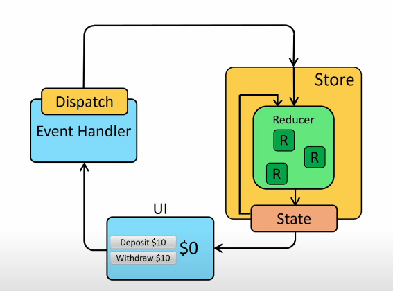

## Redux란?

- 상태 관리 라이브러리
- 단방향 데이터 흐름
- 여러 컴포넌트들이 하나의 state에 접근해야할 때 편리

## Redux 구성 요소

1. store

- Redux의 데이터들을 저장하기 위한 저장소

2. state

- Redux Store에 저장되어 있는 데이터

3. action

- Redux Store에 저장되어 있는 데이터에 변화를 주기 위한 행동

4. action Creater

- action 객체를 생성하는 역할을 하는 함수

5. reducer

- action이 발생하면 action을 실제로 처리하는 역할을 하는 함수
- reducer가 가공하여 return하는 값이 새로운 state값이 됨.

6. subscribe

- state가 바뀔 때마다 render 함수를 호출하여 ui가 새롭게 갱신

7. dispatch

- reducer를 호출해서 state값을 바꿈
- subscribe을 이용해서 render함수 호출

